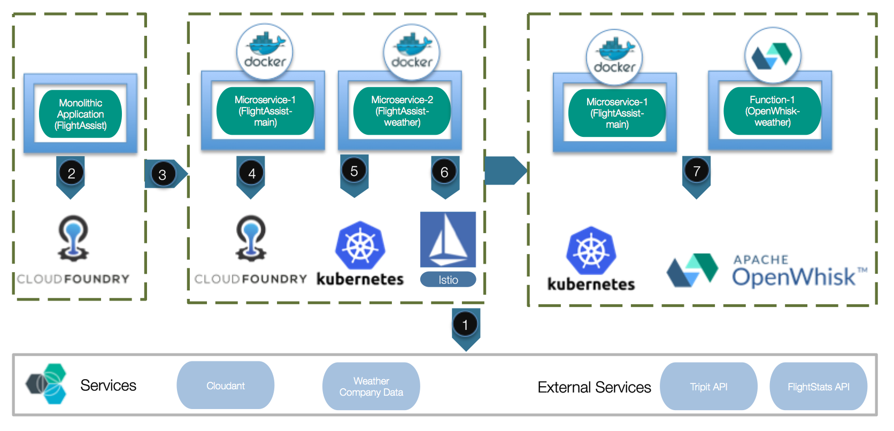
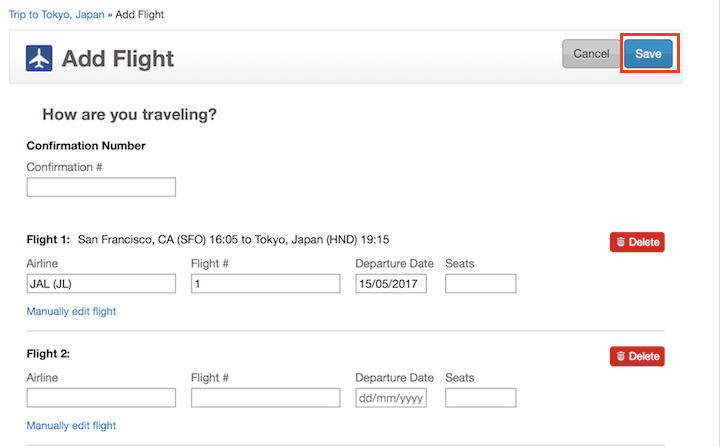
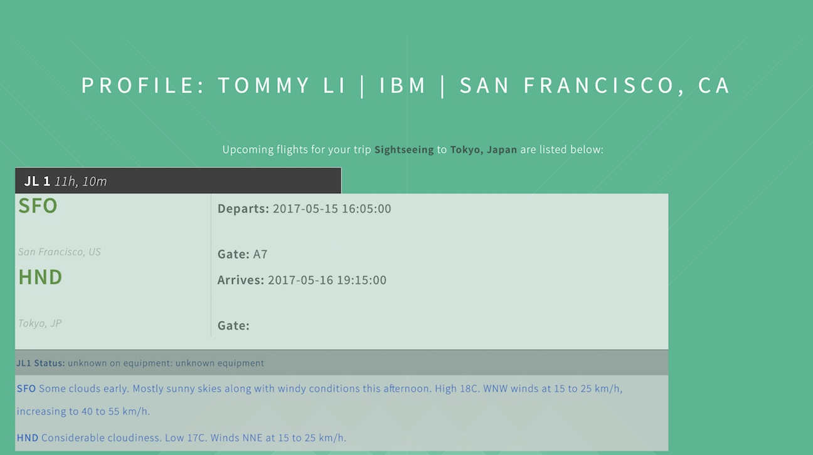

[](https://travis-ci.org/IBM/Microservices-deployment-with-PaaS-Containers-and-Serverless-Platforms)

# Navigate application deployment options with Cloud Foundry, Kubernetes, OpenWhisk and Istio

PaaS platforms like Cloud Foundry, container orchestrators like Kubernetes, Serverless platforms like OpenWhisk and Service-mesh like Istio are all great technologies to deploy and manage your microservices on. Common wisdom says there is no such thing as too many choices, but abundance of choices can lead to analysis paralysis.  In this code, we look at deployment experience the different platforms provide, and what do we gain and loose by choosing one vs another. 

We start with a sample Node.js monolithic application, Flightassist, factor it into two microservices, and then use it for demonstrating and comparing various deployment technologies. A set of trade-offs and comparisions can be made between these deployment models, and this application provides a basis for those discussions.



#### [Scenario One: Deploy Flightassist monolithic application on Cloud Foundry](#2-deploy-monolithic-flightassist-application-using-cloud-foundry) 
#### [Scenario Two: Deploy Flightassist microservices on Cloud Foundry](docs/cloudfoundry-microservice.md) 
#### [Scenario Three: Deploy Flightassist microservices on Kubernetes Clusters](docs/kubernetes-microservice.md)
#### [Scenario Four: Deploy Flightassist microservices on Istio](docs/kubernetes-istio.md)
#### [Scenario Five: Deploy Flightassist microservices augmented with functions on OpenWhisk](docs/kubernetes-serverless.md)

## Included Components
The scenarios are accomplished by using:

- [Cloud Foundry](https://www.cloudfoundry.org)
- [Kubernetes Clusters](https://console.ng.bluemix.net/docs/containers/cs_ov.html#cs_ov)
- [Istio](https://istio.io)
- [OpenWhisk](https://www.ibm.com/cloud-computing/bluemix/openwhisk)
- [Cloudant NoSQL Database](https://cloudant.com)
- [Insights for Weather](https://console.ng.bluemix.net/docs/services/Weather/weather_overview.html#about_weather)
- [TripIt Developer API](https://www.tripit.com/developer)
- [FlightStats Developer API](https://developer.flightstats.com)

## Prerequisites

Register and obtain the keys for [FlightStats Developer API](https://developer.flightstats.com/signup) and [TripIt Developer API](https://www.tripit.com/developer/create) to query flight status. 

When signing up for a FlightStats developer key, note that there is a review process that may take 24 hours or more to get your application credentials activated for a 30-day trial with the API.

## Deploy using DevOps Toolchain 

Click the button to deploy your app and fill in all the variables from **Delivery Pipeline**. For Further instructions, please follow the [Toolchain instructions](https://github.com/IBM/container-journey-template/blob/master/Toolchain_Instructions_new.md).

[](https://console.ng.bluemix.net/devops/setup/deploy/)

### Toolchain Scenarios One: Monolithic Application
You should see a link under the Cloud Foundry Deploy stage and that's where your application is hosting. 

### Toolchain Scenarios Two: Microservices on Kubernetes Clusters, with or without Serverless capabilities

If you want to deploy with microservices, please leave the **OpenWhisk Auth** variable blank on **Delivery Pipeline**.
Otherwise, fill in the **OpenWhisk Auth** variable to enable serverless for your Flightassist.

Then, click **View logs and history** under Kubernetes Deploy stage in your pipeline to access your application via the URL link at the end of your logs.

# Steps

## Part A: Deploy, test and factor monolithic application into microservices:

1. [Provision application services - Cloudant Database and Insights for Weather Service](#1-create-your-cloudant-database-and-insights-for-weather-service)
2. [Deploy monolithic application](#2-deploy-monolithic-flightassist-application-using-cloud-foundry)
3. [Factor monolithic application into microservices and test](#3-factor-monolithic-application-into-microservices-and-test)
 
## Part B: Deploy microservices leveraging:

4. [Cloud Foundry](docs/cloudfoundry-microservice.md)
5. [Kubernetes Cluster](docs/kubernetes-microservice.md)
6. [Istio](docs/kubernetes-istio.md)
7. [OpenWhisk](docs/kubernetes-serverless.md)

After you deployed Flightassist using any platform, you can go to [How to Use Flightassist](#how-to-use-flightassist) and start testing your application.

# 1. Create your Cloudant Database and Insights for Weather Service

First, clone and get in our repository to obtain the necessary files and scripts for building this example.

```bash
git clone https://github.com/IBM/Microservices-deployment-with-PaaS-Containers-and-Serverless-Platforms.git && cd Microservices-deployment-with-PaaS-Containers-and-Serverless-Platforms
```

Since we need to create services using the command line, we need to install [Bluemix CLI](http://clis.ng.bluemix.net/ui/home.html) before proceeding to the following steps.

We will use Bluemix's [The Cloudant NoSQL database service](https://console.ng.bluemix.net/catalog/services/cloudant-nosql-db?env_id=ibm:yp:us-south) and [Insights for Weather service](https://console.ng.bluemix.net/catalog/services/weather-company-data?env_id=ibm:yp:us-south) for our database and weather data. Therefore, run the following commands to create cloudant and Insights for Weather service. 

> For this example, we recommend you name your services to *mycloudant* and *myweatherinsights*.

```bash
bx service create cloudantNoSQLDB Lite mycloudant
bx service create weatherinsights Free-v2 myweatherinsights
```

Before moving on, the demo application is missing code to create the databases used to cache API responses in your newly created Cloudant instance. You can run the following commands with your cloudant URL to create the databases.

```bash
bx service key-create mycloudant {service key} #You can put any name for your {service key}
bx service key-show mycloudant {service key} #This will output your cloudant credential, "url" is Your cloudant URL
curl -k -X PUT {your-cloudantURL}/trips
curl -k -X PUT {your-cloudantURL}/weather
curl -k -X PUT {your-cloudantURL}/connections
```
# 2. Deploy monolithic Flightassist application using Cloud Foundry

In this scenario, we will deploy Flightassist as a monolithic application and host it on Cloud Foundry.

First, type the following commands to push your application with your own unique application name.

```bash
bx app push {your_unique_app_name} -f main_application/manifest.yml
```

Now, go to https://console.ng.bluemix.net/dashboard/apps and select your application. Click the *Runtime* settings for your application and add these four environment variables to set up external credentials to the TripIt and FlightStats services:
   - `FLIGHTSTATS_APP_ID` : application ID assigned by FlightStats
   - `FLIGHTSTATS_APP_KEY` : application key assigned by FlightStats
   - `TRIPIT_API_KEY` : API key assigned by TripIt
   - `TRIPIT_API_SECRET` : API secret assigned by TripIt
   - `BASE_URL`: You URL for accessing your application. e.g. https://{app_name}.mybluemix.net/

Your application should restart automatically but can be done manually as well
in the UI. With the service bindings and added environment variables, the
application should be operational at the hostname route you selected for your CF
application. 

Congratulation, now you can learn about [How to Use Flightassist](#how-to-use-flightassist) and start testing your application.

# 3. Factor monolithic application into microservices and test

To factor the application into microservices, we add a python microservice to the picture. Instead of directly accessing the apis from Node app, the python program will serve as a proxy to query. This step tests the two microservices and associated dockerfiles which are created.

First, install [Docker CLI](https://www.docker.com/community-edition#/download).

Next, edit the `docker-compose.yaml` file and add your credentials for **FLIGHTSTATS_APP_ID**, **FLIGHTSTATS_APP_KEY**, **TRIPIT_API_KEY**,**TRIPIT_API_SECRET**,**CLOUDANT_URL**, and **WEATHER_URL**. You can run the following command to view your service credentials.

```bash
bx service keys {service_name} #This will output all your service keys
bx service key-show {service_name} {service key} #This will output your service credential, "url" is Your service URL
```

Then, run the following commands to build your docker images and run Docker Compose. 

```bash
docker build -f main_application/Dockerfile.local -t flightassist main_application
docker build -f flightassist-weather/Dockerfile.alpine -t weather-service flightassist-weather
docker-compose up
```
Now, your FlightAssist application should be running on http://localhost:3000/

# Deploy microservices leveraging

Now you know to deploy your application and microservices on your local host. So let's deploy your application and microservices on the cloud with these 4 different scenarios. You can view [Summary](#summary) to have an overview of the pros and cons for each scenarios.

1. [Cloud Foundry](docs/cloudfoundry-microservice.md)
2. [Kubernetes Cluster](docs/kubernetes-microservice.md)
3. [Istio](docs/kubernetes-istio.md)
4. [OpenWhisk](docs/kubernetes-serverless.md)


# How to Use Flightassist

First, you want to [add a trip on TripIt](https://www.tripit.com/trip/create). Then, add a new flight plan for your trip. In your plan, please fill in your confirmation number or airline with flight number.



Once you added a new plan and you have your Flightassist running, open your Flightassist and click **Authenticate with TripIt** to login to Flightassist.

Now you can see the most recent flight status and weather for all your flights within 24 hours.



# Summary

It's hard to compare the different technologies toe to toe since they are targeted for different use cases. However,we can get a sense of their pros and cons from the above example.

**Cloud Foundry**: Developer Centric; Developers don't have to build or maintain containers; Support various programming languages and libraries; Large bases of services; Kind of hacky to deploy multi apps; Needs to know CF functions well to manage.    

**Kubernetes**: Orchestration tool that manages complicated container delolyments well; Large services available ;Developer has to build and maintain containers in the repositories.   

**Istio**: Addtion to Kubernetes; Provide load balancing and other features; Needs to know the "envoy" concept.   

**OpenWhisk**: Serverless, event triggering; low cost; function based, doesn't work for large apps; Stateless.

# Reference 

This project is based on this [flightassist](https://github.com/estesp/flightassist) example.

[Phil Estes](https://github.com/estesp) and [Lin Sun](https://github.com/linsun) are the main contributors for the [flightassist](https://github.com/estesp/flightassist) example.

# License
[Apache 2.0](LICENSE)
